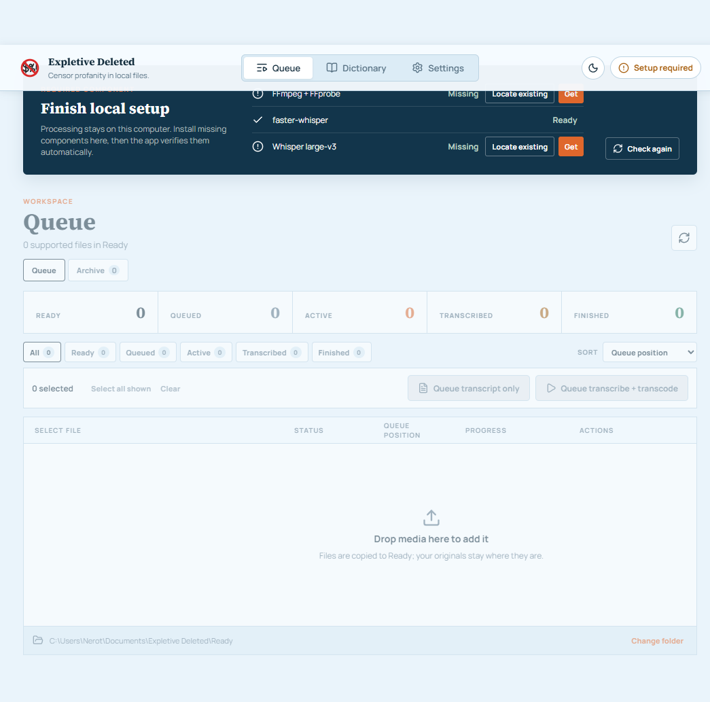

# Expletive Deleted


**Create a family-friendly copy of audio or video without uploading your media.**

[Website](https://nerotas.github.io/expletive-deleted/) |
[Download for Windows](https://github.com/Nerotas/expletive-deleted/releases/latest) |
[Support development](https://ko-fi.com/nicholaserotas) |
[Quick start](QUICKSTART.md) |
[Troubleshooting](TROUBLESHOOTING.md)



Expletive Deleted is a Windows desktop application that transcribes spoken language locally, finds words you have chosen to censor, and creates a separate censored copy with FFmpeg. It is designed for parents and media owners who want control over what their family hears without sending private media or transcripts to a cloud service.

Version **1.0.5** is the current Windows release.

Expletive Deleted is free to use. [Ko-fi support](https://ko-fi.com/nicholaserotas) is optional and does not unlock features or priority service.

## What it does

- Processes supported audio and video locally on your computer.
- Lets you maintain your own censored-word and exclusion dictionaries.
- Offers a review-first **Transcribe only** workflow before media is changed.
- Creates censored copies with predictable full-audio muting or optional stereo dialogue cancellation.
- Runs queued jobs one at a time with visible status, progress, and error details.
- Keeps source files by default and never silently overwrites output.

Automated transcription and censorship are not perfect. Always review the transcript and finished media before sharing it.

## How it works

1. Add media by placing it in the configured **Ready** folder or dragging it into the Queue.
2. Choose **Transcribe only** to create and review a local transcript.
3. Classify discovered words as **Censor** or **Ignore** in the Dictionary when needed.
4. Choose **Transcribe + Transcode** to create a censored copy in **Finished**.
5. Review the finished file. The original remains in Ready unless you deliberately archive it after success.

Compatible transcripts can be reused. **Retranscribe** replaces an existing transcript while retaining finished media; **Retranscode** creates and verifies replacement output before removing the previous result.

## Install on Windows

1. Install Python 3.9 or later from a trusted Python distribution. Ensure the `py` launcher or `python` command is available.
2. Download `Expletive-Deleted-Setup-1.0.5-x64.exe` from the [latest release](https://github.com/Nerotas/expletive-deleted/releases/latest).
3. Run the installer, then open **Expletive Deleted** from the Start menu or desktop shortcut.
4. Complete the first-run walkthrough. It checks required components, prepares your dictionary, and confirms working folders and censoring preferences.

The installer contains the Electron application and first-party Python backend. It does **not** bundle Python, Python processing packages, the external `ffmpeg.exe`/`ffprobe.exe` runtime, or Whisper models.

When a component is missing, the app shows its status and offers an inspectable setup plan. Nothing is retrieved until you choose an action, review the source and destination, and approve it. Valid existing installations can be selected instead.

## Requirements

- Windows x64
- Python 3.9 or later
- FFmpeg and FFprobe
- `faster-whisper` and its Python dependencies
- Whisper `large-v3`, the supported accuracy baseline
- Disk space for the model, source media, transcripts, and finished copies

The first-run walkthrough verifies readiness. A network connection is needed only when you choose to retrieve a missing third-party component.

## Privacy and file safety

- Media, transcripts, dictionaries, and settings remain local by default.
- The application does not require an account or upload media for processing.
- Source files are retained after successful processing unless success-only archival is explicitly enabled.
- Failed or cancelled jobs retain the source and remove incomplete output when safe.
- Existing destination files are not silently replaced.
- Dependency downloads require an explicit, reviewed approval.

User media defaults to:

```text
%USERPROFILE%\Documents\Expletive Deleted\
├── Ready
├── Finished
├── Processed
└── Transcripts
```

Settings, the durable user dictionary, and explicitly retrieved runtime components are stored beneath `%LOCALAPPDATA%\ExpletiveDeleted`. Uninstalling the desktop application does not silently remove those files or user media.

## Censoring choices

**Drop audio** is the default and most predictable option. It silences the complete audio mix during each detected interval, including dialogue, music, and effects. It works with mono and stereo sources.

**Karaoke** attempts to cancel centered dialogue in stereo audio while retaining some music and effects. Results depend on the source mix, off-center speech may remain, and it is not appropriate for mono audio.

Recognized surround sources are handled separately: the front-center dialogue channel is censored before the selected surround output is preserved or downmixed.

## Supported media

Supported inputs include `.avi`, `.flv`, `.m4a`, `.mkv`, `.mov`, `.mp3`, `.mp4`, `.wav`, `.webm`, and `.wmv`. Audio-only jobs produce `.mp3`; video jobs produce `.mkv`.

## Develop from source

Source development requires:

- Node.js 22.12 or later
- Python 3.9 or later
- A repository-local `.venv`

Prepare the Python environment from the repository root:

```powershell
python setup.py
```

Start the complete Electron application from one terminal:

```powershell
cd frontend
npm install
npm run dev
```

Electron starts and owns the private Python bridge. Vite is used only to build and hot-reload the renderer; this is not a browser-hosted application.

Create and audit the Windows installer:

```powershell
cd frontend
npm run package:win
```

The package audit fails if the installer contains the external processing FFmpeg runtime, Whisper model payloads, or Python binary packages. Electron's framework-owned root `ffmpeg.dll` is Chromium codec support and cannot satisfy processing readiness.

## Releases and versioning

`frontend/package.json` records the source-tree application version. Run the synchronizer after choosing a version locally:

```powershell
cd frontend
npm version patch --no-git-tag-version
npm run version:sync
npm run version:check
```

When application changes reach `main`, the [Release workflow](.github/workflows/release.yml) chooses the next patch version from the latest published release, synchronizes version metadata in the build runner, and runs backend, renderer, native, packaging, and installed-app checks. It then creates a local metadata commit, pushes only its tag, and publishes the Windows installer. The tagged source therefore matches the packaged version without writing the commit to protected `main`. Documentation and workflow-only changes do not trigger a release.

If an application pull request deliberately raises `frontend/package.json` above the latest published version, that version is used. Manual workflow runs may choose `patch`, `minor`, `major`, or `none`.

Repository Actions must have **Read and write permissions** so the workflow can push the release tag and create the GitHub Release. It never pushes commits to protected `main` or creates a release pull request. A failed validation does not tag or publish the release.

## Validation

Backend, from the repository root:

```powershell
.\.venv\Scripts\python.exe -m unittest discover -s tests
```

Desktop, from `frontend/`:

```powershell
npm test
npm run typecheck
npm run lint
npm run build
npm run smoke
```

## Architecture

```text
backend/                  Python source of truth for settings, jobs, policy, and media safety
frontend/electron/        Native window, lifecycle, preload API, and Python child process
frontend/src/             React renderer and typed desktop client
resources/                Factory dictionary resources
scripts/                  Bootstrap, diagnostics, and maintenance commands
tests/                    Backend regression tests
docs/                     Product site and design documentation
```

The renderer uses React Router, TanStack Query, and React Hook Form. It communicates only through the context-isolated typed preload API. `nodeIntegration` remains disabled, and the renderer receives no arbitrary filesystem, process, or shell access.

## Advanced command line

The desktop application is the normal user experience. The compatibility CLI remains available for development, automation, diagnostics, and headless operation:

```powershell
.\.venv\Scripts\python.exe diagnostics.py
.\.venv\Scripts\python.exe backend_app.py capabilities
.\.venv\Scripts\python.exe batch_process.py --list
.\.venv\Scripts\python.exe batch_process.py --report-only
```

See [QUICKSTART.md](QUICKSTART.md) for complete installed-app, source-build, and advanced CLI instructions.

## Project links

- [Product website](https://nerotas.github.io/expletive-deleted/)
- [Windows releases](https://github.com/Nerotas/expletive-deleted/releases)
- [Issue tracker](https://github.com/Nerotas/expletive-deleted/issues)
- [Support development on Ko-fi](https://ko-fi.com/nicholaserotas)
- [Desktop developer notes](frontend/README.md)
- [Troubleshooting](TROUBLESHOOTING.md)
